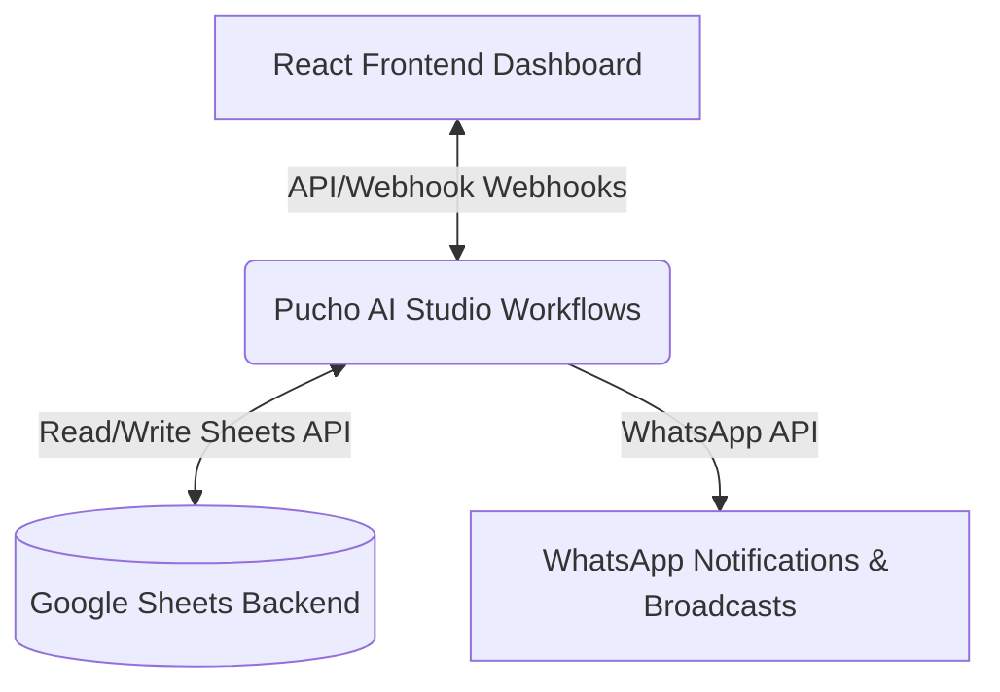

# 🚀 Marketing OS (Marketing Management System)

A state-of-the-art **Marketing Management & Automation System** designed for MSMEs to streamline campaigns, automate lead tracking, calculate ROI in real-time, schedule content, and manage dealer/field sales operations. 

Built with a **WhatsApp-first approach**, the system integrates a high-performance **React dashboard** (powered by Vite, Tailwind CSS, Ant Design, and Framer Motion) with **Google Sheets** as the backend database, automated via **Pucho AI Studio workflows**.

---

## 🏗️ System Architecture



The application leverages a two-way synchronization:
1. **Frontend (Vite + React + Zustand)** reads data in real-time from a publicly published Google Sheet (bypassing CORS blocks) and triggers operations using Pucho AI Studio webhook endpoints.
2. **Pucho AI Studio** acts as the middleware and automation runner, capturing webhook events, running conditional logic, dispatching WhatsApp messages/reminders, and writing database changes back to the Google Sheet.
3. **Google Sheets** serves as a lightweight, transparent, and easily customizable relational backend database.

---

## 📋 Features

### 1. Core Modules & Dashboards
*   **Unified Dashboard:** Visualizes active Pucho workflows, critical MSME pain points status, real-time lead acquisition metrics, campaign performance, and recent activity logs.
*   **Campaign Manager:** Track and plan marketing campaigns (Festive, Product launch, Discounts, Branding) with duration, budget, target audience, and active channels.
*   **Leads Tracker:** Real-time visibility into the lead funnel (New, Contacted, Qualified, Converted, Lost) categorized by acquisition sources (WhatsApp, Instagram, Facebook, Google Ads).
*   **Content Calendar:** Visual planner to schedule and draft social media content across platforms (Instagram, Facebook, WhatsApp, LinkedIn).
*   **ROI Tracker:** Auto-calculates return on investment, cost-per-lead (CPL), and conversion rates per campaign.
*   **WhatsApp Broadcast Manager:** Set up message templates, select customer segments (all, new leads, active customers), schedule broadcasts, and monitor delivery statistics (Sent, Delivered, Responded).

### 2. Operational & B2B Extensions
*   **AMC & Service Renewals:** Tracks Annual Maintenance Contracts and automatically flags contracts due for renewal.
*   **Dealer Schemes:** Manages active distributor & dealer cashback/discount schemes with a live status tracker.
*   **Field Sales Tracker:** Logs field representative client visits, locations, and visit notes to prevent untracked field activity.
*   **Dealer KYC Onboarding:** Automates B2B dealer onboarding and tracks KYC verification states.
*   **Quotation Generator:** Creates digital quotations and sends them dynamically.
*   **Testimonial Collector:** Gathers customer feedback and reviews to build social proof.

---

## 🛡️ Resolving Indian MSME Pain Points

Marketing OS addresses 14 key organizational pain points (`src/hooks/useStore.js`):

| ID | Pain Point | Category | Severity | Automated Workflow Solution |
| :--- | :--- | :--- | :--- | :--- |
| **PP1** | Lead Leakage | Leads | Critical | **WF2**: Instant lead capture via WhatsApp integration |
| **PP2** | Ad-hoc Follow-up | Leads | High | **WF15**: Automated re-engagement sequences |
| **PP4** | Manual Quotations | Operations | High | **WF8**: Automated PDF quote generator |
| **PP6** | Untracked Field Visits | Sales | High | **WF10**: Real-time sales rep check-in sync |
| **PP9** | Slow KYC Approvals | Operations | High | **WF11**: B2B KYC verification workflow |
| **PP10** | Missed Renewals | Retention | Medium | **WF13**: Daily AMC renewal alerts |
| **PP11** | Marketing ROI Blindness | Analytics | Critical | **WF3**: Automatic ROI & Cost-Per-Lead calculator |
| **PP14** | Delayed Payments | Operations | Critical | **WF14**: Automatic WhatsApp payment reminders |

---

## 🚀 Quick Start Guide

### Prerequisites
*   **Node.js** v18 or higher
*   **Google Account** (for Google Sheets)
*   **Pucho AI Studio** Account

### Step 1: Clone & Install Dependencies
```bash
git clone https://github.com/damini-alt/Marketing-OS.git
cd Marketing-OS
npm install
```

### Step 2: Google Sheets Setup
1. Create a new Google Spreadsheet.
2. Add the following tabs with exact names:
   *   `Campaigns`
   *   `Leads`
   *   `Content_Calendar`
   *   `ROI_Tracker`
   *   `Broadcasts`
   *   `Settings`
   *   `Quotations`
   *   `Dealer_Schemes`
   *   `Field_Sales`
   *   `KYC_Onboarding`
   *   `Testimonials`
3. Set Spreadsheet permissions: **"Anyone with the link can view/edit"**.
4. In Google Sheets, select **File > Share > Publish to web** as Web Page (this enables CORS-free reading of data).
5. Extract the spreadsheet ID from your URL (e.g. `https://docs.google.com/spreadsheets/d/[SPREADSHEET_ID]/edit`).

### Step 3: Configure Environment & Store Config
Open [sheetsConfig.js](file:///d:/Projects/Marketing-OS/src/config/sheetsConfig.js) and fill in your details:
*   `spreadsheetId`: The public published Spreadsheet ID (used for reading).
*   `editSpreadsheetId`: The private Spreadsheet ID (used by workflows to write).
*   `gids`: Ensure sub-sheet GIDs (found in URLs as `gid=xxx`) match your Google Sheet tab GIDs.
*   `webhookUrls`: Replace with your Pucho AI Studio webhook endpoints.

### Step 4: Import Workflows to Pucho AI Studio
Import the JSON workflow templates from your local `workflows/` directory into Pucho Studio:
*   `WF1_Campaign_Management.json`
*   `WF2_Lead_Tracking.json`
*   `WF3_ROI_Calculator.json`
*   `WF4_Content_Calendar.json`
*   `WF5_Broadcast.json`
*   `WF6_Notifications.json`
*   `WF7_Data_Sync.json`
*   *(And other operational workflow JSONs)*

### Step 5: Start the Development Server
```bash
npm run dev
```
Open [http://localhost:5173](http://localhost:5173) in your browser.

---

## 📁 Repository Structure
```
Marketing-OS/
├── Login Page/                  # Custom Login Screen designs & prompts
├── src/
│   ├── assets/                  # Images and graphic assets
│   ├── components/
│   │   ├── charts/              # Recharts implementations (BarChart, AreaChart)
│   │   ├── common/              # Reusable UI components (DataTable, StatCard, Badge)
│   │   └── layout/              # Sidebar and Header components
│   ├── config/
│   │   └── sheetsConfig.js      # Google Sheets and webhook endpoints configuration
│   ├── hooks/
│   │   └── useStore.js          # Zustand store managing states, fetch actions, and sync
│   ├── pages/                   # Application Pages & Views (Campaigns, Leads, ROI, etc.)
│   ├── App.jsx                  # Main Routing and Page Container
│   ├── index.css                # Base CSS rules & Tailwind configuration
│   └── main.jsx                 # Vite Entrypoint
├── package.json                 # Node dependencies and build scripts
├── postcss.config.js            # PostCSS plugin configurations
├── tailwind.config.js           # Tailwind CSS configuration rules
├── vite.config.js               # Vite compilation settings
└── implementation_guideline.md  # System details & spreadsheet column structures
```

---

## 🛠️ Tech Stack
*   **Core:** React 18, Vite 5, JavaScript (ES6+ Module)
*   **Styling:** Tailwind CSS 3, Ant Design (antd 5), Framer Motion 11 (animations)
*   **Charts:** Recharts
*   **State Management:** Zustand 4
*   **Backend Automation:** Pucho AI Studio & Google Sheets APIs
